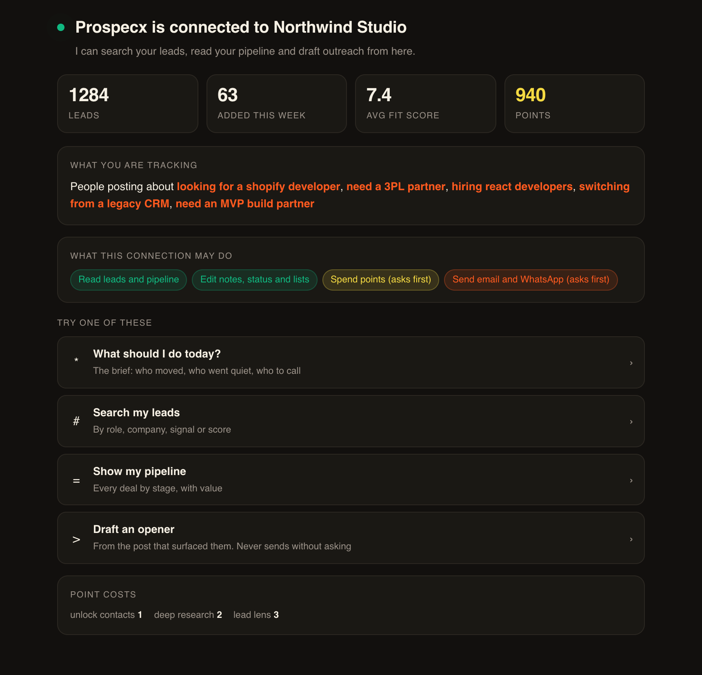
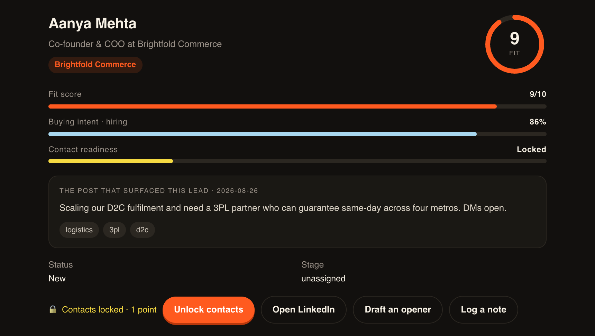

<div align="center">


<br>

**Run your B2B lead pipeline from Claude, Cursor, or any MCP client.**

Find people posting buying intent, read the post that surfaced them, draft the
opener, and move the deal — without leaving the conversation.

<br>

[](LICENSE)
[](https://modelcontextprotocol.io)
[](docs/TOOLS.md)
[](docs/AUTH.md)
[](package.json)

</div>

---

## What it looks like

Clients that support [MCP Apps](https://modelcontextprotocol.io) render these
inline. Everywhere else the same facts arrive as text — nothing is lost, it is
just less pretty.

<table>
<tr>
<td width="50%" valign="top">

**Your first question** — `prospecx_start_here`



</td>
<td width="50%" valign="top">

**One lead** — `prospecx_get_lead`



</td>
</tr>
</table>

> Screenshots use invented demo data. No real lead appears in this repository.

---

## Quick start

You do **not** need an API key. The hosted connector uses OAuth — you sign in
with your Prospecx account and approve the scopes you want.

```
https://prospecx.in/api/mcp
```

Paste that URL into your client's *Add connector* / *Add MCP server* box, click
**Connect**, and approve. That is the whole setup.

Then just ask:

> "What should I do today in Prospecx?"

Per-client instructions — including **Claude Cowork** and how to stop it asking
on every tool call — are in [docs/SETUP.md](docs/SETUP.md).
[docs/PROMPTS.md](docs/PROMPTS.md) is a page of things worth asking.

Manage it from **Settings → MCP** in Prospecx: what is connected, what it was
allowed to do, what it has been calling, and a Disconnect button that works
immediately.

---

## Connect

**One URL. No API key, nothing to install.**

```
https://prospecx.in/api/mcp
```

You approve the connection with your normal Prospecx login and can revoke it any
time from **Settings → API keys**.

### Claude (desktop or web)

Settings → Connectors → **Add custom connector** → paste the URL → **Connect** →
**Approve** on the Prospecx screen that opens.

### Claude Code

```bash
claude mcp add --transport http prospecx https://prospecx.in/api/mcp
```

Your browser opens to approve the connection the first time you use it.

### Cursor

`~/.cursor/mcp.json`:

```json
{
  "mcpServers": {
    "prospecx": { "url": "https://prospecx.in/api/mcp" }
  }
}
```

### Local / stdio

The npm package runs the server over stdio against an API key, for clients that
cannot do OAuth or for local development.

```bash
npx @prospecx/mcp
```

**It ships a subset: 13 tools, not 18.** The three send tools, `prospecx_start_here`
and `prospecx_draft_outreach` are connector-only for now. Use the hosted
connector above unless you specifically need stdio — it needs no API key, and it
is where new tools land first.

See [docs/LOCAL.md](docs/LOCAL.md).

---

## Try it

```
what should I do today?
find leads hiring for React, score 7 or above
show me lead Asha
how many points do I have left?
add a note to that lead saying I called them
```

Or use a slash command: `/prospecx_daily_standup`, `/prospecx_prep_call`,
`/prospecx_write_outreach`.

---

## Tools

Twenty-five tools over the hosted connector. Every one is listed here; nothing
is hidden behind a flag.

### Start here

| Tool | What it does |
|---|---|
| `prospecx_start_here` | Your workspace as it actually is — lead count, what it tracks, points balance, what this connection may do — plus opening moves built from that state. Free, no arguments, and the best first call in any conversation. |

### Read — free, and cannot change anything

| Tool | What it does |
|---|---|
| `prospecx_get_today_brief` | The day's digest: moves worth making, deals at risk, forecast |
| `prospecx_search_leads` | Search by text, status, minimum fit score |
| `prospecx_get_lead` | One lead in full, including the post that surfaced them. Renders as an **interactive card** in clients that support MCP Apps |
| `prospecx_get_pipeline` | Leads by stage, with counts and deal value |
| `prospecx_get_account` | Points balance and the price of every chargeable action |
| `prospecx_get_insights` | Workspace counters: totals, recent adds, average fit |
| `prospecx_get_agenda` | Follow-up reminders due soon |
| `prospecx_get_lists` | Saved lists, or the leads inside one |

### Radar — what your watched leads just did

| Tool | What it does |
|---|---|
| `prospecx_get_radar` | Which leads you are watching, and what they have just posted or changed |
| `prospecx_watch_lead` | Put a lead on Radar, or take them off |

### Meetings — calls, transcripts and minutes

| Tool | What it does |
|---|---|
| `prospecx_get_meetings` | Upcoming or past calls, with the lead each is about |
| `prospecx_get_meeting` | One meeting in full, including transcript and minutes if a notetaker attended |

### Proposals — what you quoted and who read it

| Tool | What it does |
|---|---|
| `prospecx_get_proposals` | Every proposal, and whether it was sent, opened or accepted |
| `prospecx_get_proposal` | One proposal in full — scope, pricing and body |

### Write — free, and only touches your own records

| Tool | What it does |
|---|---|
| `prospecx_draft_outreach` | Email subject and body, a WhatsApp message, a LinkedIn DM and a 30-second call script — all anchored on the post that surfaced the lead. Drafts only; nothing is sent |
| `prospecx_annotate_lead` | Note, status and follow-up reminder in one call |
| `prospecx_manage_list` | Create a list and/or add leads to it |
| `prospecx_update_deal` | Set deal value, currency, pipeline stage |
| `prospecx_add_lead` | Add a lead manually |

### Spend — costs prepaid points, charged on the first call

| Tool | Cost |
|---|---|
| `prospecx_find_new_leads` | **1 point per lead requested** — goes out and finds people you do not have yet |
| `prospecx_unlock_lead_contacts` | 1 point (contacts) · 2 points (deep research) |

A **daily ceiling** (default 50 points) bounds what the connector can spend,
whatever the balance holds. `prospecx_get_account` reports what is left of it.

### Reach a person — shows you the message first

These reach a real human under your name, **on the first call**. There is no
confirmation step — see [Spending](#how-spending-works) below before granting
`send:outreach`.

| Tool | What it does |
|---|---|
| `prospecx_send_email` | Sends an email from your connected mailbox. The lead's contact must already be unlocked |
| `prospecx_send_whatsapp` | Sends a WhatsApp message. Requires an unlocked phone number |
| `prospecx_enroll_in_sequence` | Puts a lead into an automated follow-up sequence |

**LinkedIn is draft-only.** `prospecx_draft_outreach` writes a LinkedIn DM for
you to copy across. Prospecx has no LinkedIn send path and LinkedIn exposes no
DM API, so no tool here claims otherwise.

---

## Prompts

Prompts appear as **slash commands** in clients that support them.

| Prompt | What it does |
|---|---|
| `prospecx_daily_standup` | Turns today's brief into a prioritised plan |
| `prospecx_prep_call` | A one-page brief on a lead before you speak to them |
| `prospecx_write_outreach` | Drafts an opener grounded in what the lead posted |
| `prospecx_triage_inbox` | Ranks open leads into reply today / worth a look / let it cool, and flags overdue follow-ups |
| `prospecx_radar_check` | What your watched leads just did, and who to act on first |
| `prospecx_call_debrief` | Turns a finished call into notes, objections and a dated next step |
| `prospecx_pipeline_review` | Where the pipeline is stuck, separating proposals never opened from ones ignored |
| `prospecx_find_and_qualify` | Searches what you have first, then goes looking, then ranks what came back |
| `prospecx_warm_up_cold` | Leads that went quiet, each with one specific reason to reopen |
| `prospecx_before_i_call` | Everything about a lead on one screen, for reading while the phone rings |

---

## Resources

Resources appear in the client's **attach / context menu**.

| URI | Contents |
|---|---|
| `prospecx://today` | Today's brief |
| `prospecx://leads/hot` | Highest-scoring open leads |
| `prospecx://lead/{id}` | Any single lead, with autocomplete over real leads |

Clients supporting MCP Apps also receive two UI resources —
`ui://prospecx/welcome.html` and `ui://prospecx/lead.html` — which are what
`prospecx_start_here` and `prospecx_get_lead` render into.

---

## How spending works

Anything that costs points or sends a message **happens on the first call**.
There is no preview, no confirmation token, and no window to cancel.

Still true:

- A connection without `spend:points` cannot spend; without `send:outreach` it
  cannot message anyone. Scopes are the real gate, and you pick them.
- The amount charged always matches the amount computed.
- A lead whose contacts are locked cannot be emailed.
- Unlocking an already-unlocked lead is free and says so.
- **Disconnect** in Settings → MCP cuts a client off instantly, even
  mid-conversation.

No longer true:

- You are not shown the cost or the message first. The assistant is told to tell
  you — emphatically, in every tool description — but that is its judgement, not
  a server guarantee.

Want the old behaviour? A workspace can turn confirmation back on; see
[docs/SECURITY.md](docs/SECURITY.md). If you are unsure, connect **without**
`spend:points` and `send:outreach` — search, briefs and drafting across all four
channels are free and change nothing.

---

## Contacts are pay-per-lead

A lead with `contact_locked: true` has not had its contacts purchased. That is a
billing state, **not missing data** — unlock it and the email and phone appear.

---

## Skills

[`skills/`](./skills) contains two Agent Skills that make the connector
noticeably better to use:

- **`prospecx-prospecting`** — search strategy, what the fit score means, how to
  triage without wasting points.
- **`prospecx-outreach`** — what happens on the first call, and how to write an
  opener that does not read as a template.

---

## Documentation

| Document | What is in it |
|---|---|
| [docs/SETUP.md](docs/SETUP.md) | Connecting from Cowork, Claude, Claude Code or Cursor — and how to stop it asking on every call |
| [docs/TOOLS.md](docs/TOOLS.md) | Every tool: arguments, returns, cost, and a real example |
| [docs/PROMPTS.md](docs/PROMPTS.md) | Things worth asking, grouped by what you are trying to do |
| [docs/AGENTS.md](docs/AGENTS.md) | Orientation for AI tools reading this repo or driving the server |
| [docs/SECURITY.md](docs/SECURITY.md) | What the connector can and cannot do, and how spending is gated |
| [docs/AUTH.md](docs/AUTH.md) | The OAuth 2.1 flow, token shape, and its guarantees |
| [docs/API.md](docs/API.md) | The underlying HTTP API the tools call |
| [docs/LOCAL.md](docs/LOCAL.md) | Running the stdio server locally |

---

## Contributing

Issues and pull requests are welcome. Two things worth knowing before you open
one:

- **Tool descriptions are the product.** A model only ever sees the description,
  so a change to wording is a behaviour change, not a docs change. Say what the
  tool does, when to reach for it, and what it will refuse.
- **Nothing that spends or sends may become one-step.** The two-call contract in
  [docs/SECURITY.md](docs/SECURITY.md) is not a style preference.

---

## Licence

[MIT](LICENSE) © Indigen Services.

The Prospecx name and logo are trademarks of Indigen Services and are not covered
by the MIT licence.
